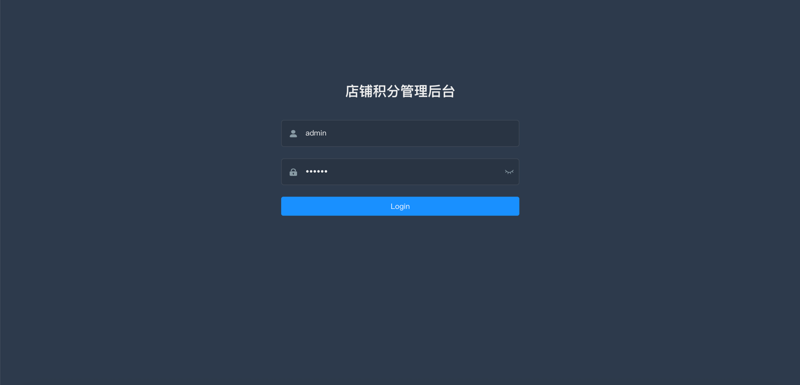
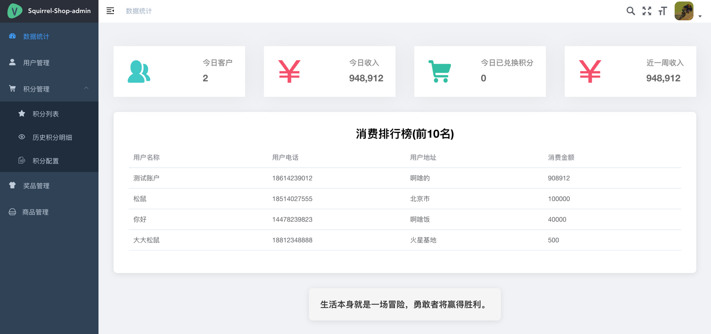
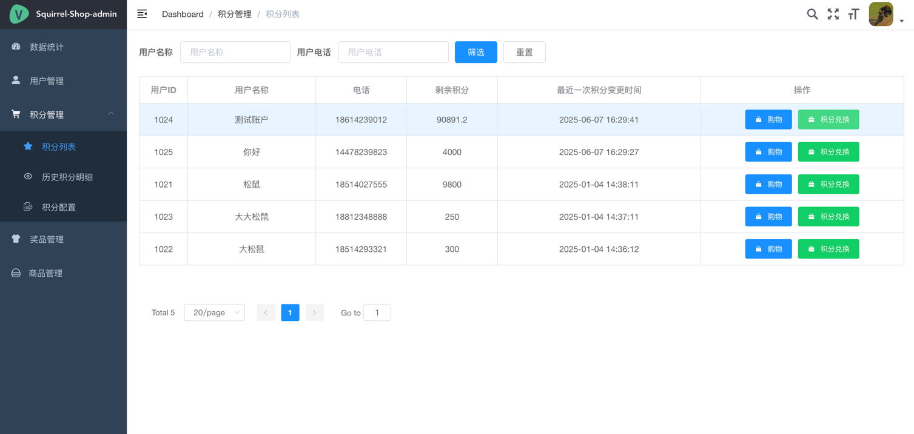
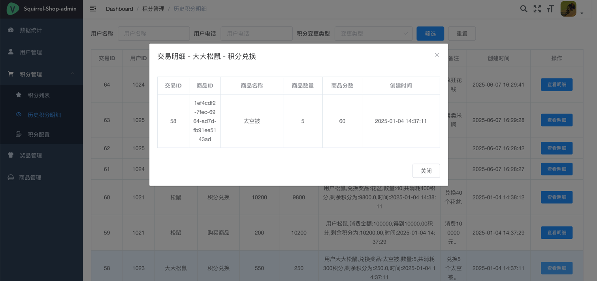

# squirrel-shop

一个前后端分离的积分管理系统。

## 项目简介

本项目是一个用于管理用户积分的系统，采用前后端分离的架构。后端负责处理业务逻辑、数据存储和安全认证，前端提供用户友好的操作界面。主要功能包括用户积分的查询、管理、积分变动历史记录等。

## 主要技术栈

*   **前端:** Vue.js
*   **后端:** Spring Boot
*   **数据库:** MySQL
*   **安全认证:** Spring Security, JWT (JSON Web Token)

## 功能特性

*   用户登录与认证 (基于JWT)
*   数据统计概览 (如日活、收入、消费排行榜等)
*   用户积分列表与查询
*   用户积分变动明细查看
*   积分配置管理 (待开发或已有基础功能)
*   商品管理 (可能用于积分兑换，待开发或已有基础功能)
*   前后端API交互

## 项目截图

（你可以在这里插入项目的关键截图，例如登录页、仪表盘、积分列表页等）

*   登录页: 
*   仪表盘: 
*   积分列表:
*   积分明细: 

## 如何运行

**1. 克隆项目**

```bash
git clone https://github.com/LeroyPine/squirrel-shop.git
cd squirrel-shop
```

**2. 后端设置**

*   进入后端项目目录
*   确保你已安装 Java 开发环境 (JDK)。
*   配置数据库连接信息：
    *   找到后端项目的配置文件 ( `src/main/resources/application.properties` 或 `application.yml`)。
    *   修改其中的 MySQL 数据库连接URL、用户名和密码。
    *   ```properties
        # application.properties 示例
        spring.datasource.url=jdbc:mysql://localhost:3306/your_database_name?useUnicode=true&characterEncoding=utf8&useSSL=false&serverTimezone=Asia/Shanghai
        spring.datasource.username=your_mysql_username
        spring.datasource.password=your_mysql_password
        spring.datasource.driver-class-name=com.mysql.cj.jdbc.Driver
        ```
*   执行数据库脚本：
    *   请在你的 MySQL 数据库中创建一个新的数据库（名称与上面配置的 `your_database_name` 相同）。
    *   运行项目提供的数据库初始化脚本（DB.sql,init.sql）。
*   构建并运行后端项目：
    *   使用 Maven 或 Gradle 构建工具（例如 Maven）：
        ```bash
        mvn clean package
        java -jar target/[你的后端jar文件名].jar
        ```
    *   或者在你的IDE (如 IntelliJ IDEA, Eclipse) 中直接运行 Spring Boot 的主类。

**3. 前端设置**

*   进入前端项目目录。
    ```bash
    cd squirrel-shop/squirrel-shop-ui
    ```
    
*   确保你已安装 Node.js 和 npm 或 yarn。
*   安装项目依赖：
    ```bash
    npm install
    ```
*   配置后端API地址：
    *   查找前端项目的环境变量配置文件（例如 `.env`, `.env.development`, `.env.production`）。
    *   配置后端API的基础URL，例如：
    *   ```env
        # .env.development 示例
        VUE_APP_BASE_API=/api # 如果使用了代理
        # 或直接写后端地址
        # VUE_APP_BASE_API=http://localhost:8080/api
        ```
    *   （具体配置方式取决于前端项目脚手架，如 Vue CLI）
*   运行前端开发服务器：
    ```bash
    npm run dev
    ```
    *   项目通常会在 `http://localhost:9527` 或其他端口启动。

**4. 访问系统**

*   在浏览器中访问前端运行的地址 (例如 `http://localhost:9527`)。
*   使用默认的管理员账号密码登录（admin 123456）。

## 贡献

欢迎提出问题和贡献代码！请提交 Pull Request 或 Issue。

## License

[请在此处说明项目的许可证类型，例如 MIT, Apache 2.0 等]

## 联系方式

邮箱: paul_pine@163.com
WX: CherishedMoments_L

---
```